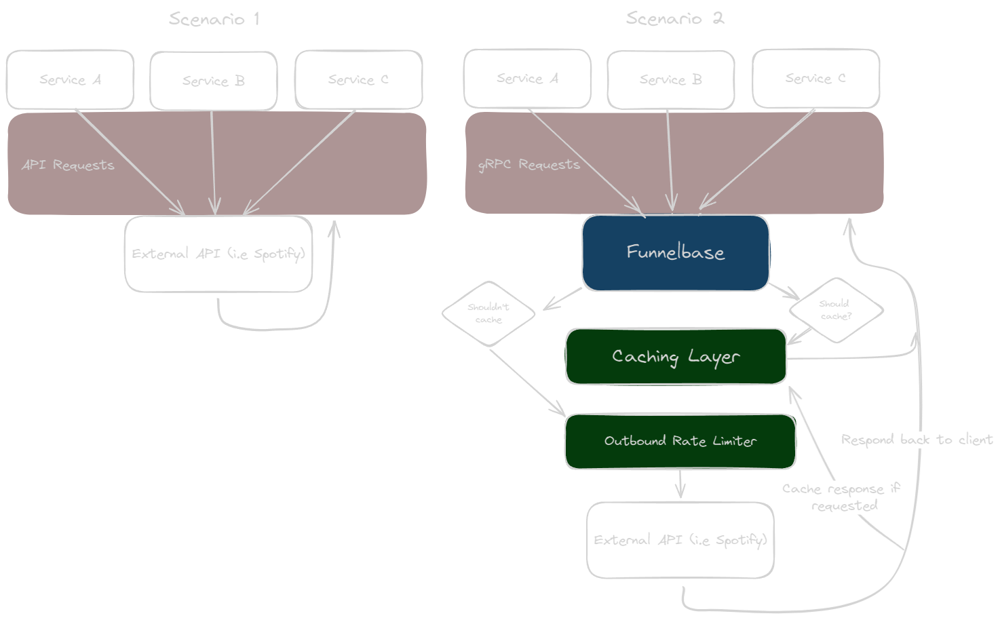

# Funnelbase

High performance microservice for rate limiting and caching of outbound requests written in Go

## Context

Development of Funnelbase came about due to the need for [Waveous](https://waveous.com/) to limit and optimise requests
going to Spotify as the number of distributed services that leaned on Spotify's API increased. Spotify API's rate limits
are vague and don't return any meaningful data about number of requests used/remaining for a period of time, only a
warning when you need to back off. This makes it complicated for microservices to control the flow of requests out to
Spotify's API.

**It is worth noting that development of Funnelbase is currently geared towards communicating with Spotify's API and
design choices will reflect this.**

Below is a diagram describing the issue and how Funnelbase fixes it.


Scenario 1 is without Funnelbase where X number of services send requests off to an external API whenever they like.
This causes 2 issues:

1. How do these microservices manage the flow of requests to an external API, especially if information about the rate
   limits are not shown?
2. If some of these microservices make the same requests within a period of time that no changes are expected to have
   occurred on the external API, how can they avoid duplication of these requests?

## Goal

Scenario 2 displays the expected flow of data. X number of services communicate with Funnelbase through gRPC. These gRPC
calls contain information about the API request they want to make. As part of this call, a cache lifespan can be
specified. If specified, it will check the caching layer (Redis) to see if the response for this API request already
exists and will return that instantly, without communicating with the external API. This is useful when
requesting [Spotify Artist](https://developer.spotify.com/documentation/web-api/reference/get-an-artist) information for
example. There may be multiple services that request the same artist information throughout the day, however this data
probably doesn't change very often, so it's worthwhile caching these responses for a period of time.

If no cache exists, no cache lifespan is provided, or it's a POST request, it will proceed to the outbound rate limiter.
Rate limits can be set per external API and can limit the throughput of requests to the external API as well as handle
back offs if requested by the API. It can also handle multiple priorities, allowing higher priority requests to flow
through before lower priority ones.

Once these sequences are completed, the API response data is sent back to the client through gRPC.

# Features

* Customisable rate limiting for each API
* Caching of responses to avoid request duplication
* Cancellation of requests if it exceeds the requests deadline
* Ability to retry if the request fails
* Monitor requests for backoff requests from APIs and respond accordingly
* Exposes metrics for Prometheus about rate limiter and caching statistics

# Usage

Funnelbase provides a list of config settings which cant either be passed through uppercased environment variables or
through lowercased arguments to go (as shown below). The config variables are:

* `PORT` - Port the Funnelbase gRPC server should run on
* `APP_ENV` - Environment of the app (development, test, production). This determines the logging format
* `REDIS_ADDR` - Address of the Redis server (localhost:6379 for development)
* `REDIS_PASSWORD` - Password for the Redis server
* `REDIS_DB`: Integer of the Redis database (defaults to 0)

If project is loaded up through any JetBrains IDE's, there will be Run Configurations available for useful commands.

## Docker

Easiest way to run Funnelbase is to use the `docker-compose.yml` file which spins up Funnelbase as well as Redis.

If you just want to build and run Funnelbase standalone, the following command can be used:

```shell
docker build -t zephos-io/funnelbase . \
&& docker run -d \
--env APP_ENV=development \
--env PORT=50051 \
--env REDIS_ADDR=localhost:6379 \
--env REDIS_PASSWORD= \
--env REDIS_DB=0 \
--name funnelbase \
zephos-io/funnelbase
```

## Go

May need to generate gRPC go bindings using the following command

```shell
make generate-grpc
```

Start the Funnelbase gRPC server using the following command

```shell
go run ./cmd/server \
-app_env=development \
-port=50051 \
-redis_addr=localhost:6379 
-redis_password= \
-redis_db=0
```

## Development

Other than `cmd/server`, there are multiple other packages in `cmd` that have assisted in development

* `cmd/test_api_server` - Fake API server with the ability to respond successfully, throw an error or tell the client to
  backoff
* `cmd/test_client` - Fake client that sends calls to Funnelbase. Act's as a service in the diagram above

Both of these are often needed to be running simultaneously for smooth development experience.